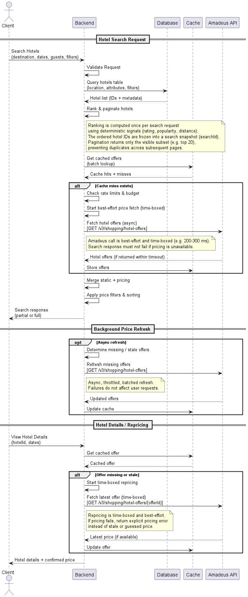
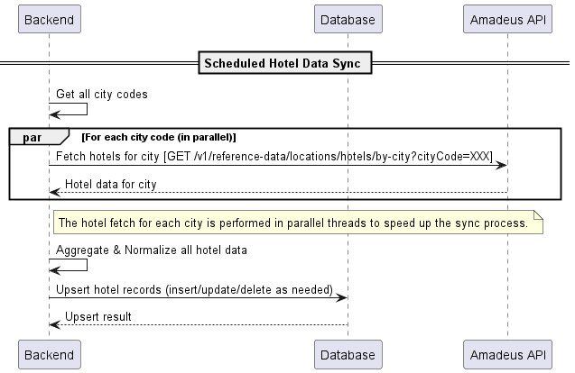
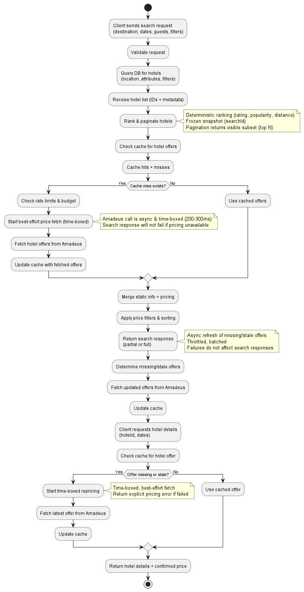

# Skyscanner Clone Backend Design

This repository documents the **Skyscanner clone backend system**, including design diagrams, pseudocode, and implementation guidance.

---

## Table of Contents

1. [Overview](#overview)
2. [Hotel Search](#hotel-search)  

---

## Overview

The backend system is designed for high-performance, and fault-tolerance.

---

## Hotel Search

## Diagrams

### Sequence Diagrams

#### 1. Hotel Search Sequence

Shows the detailed **message flow between client, backend, cache, DB, and Amadeus** for search requests.



#### 2. Hotels Table Maintenance Sequence

Shows the **scheduled background job to maintain hotels table**, including API sync and cache updates.



---

### Flowchart

The flowchart illustrates the **overall search, pricing, caching, and hotel details flow**, including decisions for cache misses and stale offers.



---

### Pseudocode

---

```java
// ----------------------------
// Hotel Search Request
// ----------------------------
function searchHotels(destination, dates, guests, filters) {
    
    // 1. Validate request
    validateRequest(destination, dates, guests, filters);

    // 2. Query hotels table from DB
    hotels = DB.queryHotels(destination, filters); // returns IDs + metadata

    // 3. Rank & paginate hotels
    rankedHotels = rankHotels(hotels); // deterministic: rating, popularity, distance
    searchSnapshot = createSearchSnapshot(rankedHotels); // searchId
    visibleHotels = paginate(rankedHotels, page=1, pageSize=20);

    // 4. Get cached offers for visible hotels
    cachedOffers = CACHE.getBatch(visibleHotels); // returns hits + misses

    // 5. Handle cache misses (best-effort, time-boxed)
    missingHotels = findCacheMisses(visibleHotels, cachedOffers);
    if (!missingHotels.isEmpty()) {
        // Check rate limits & budget
        checkRateLimits(missingHotels);

        // Start time-boxed best-effort price fetch
        asyncFetchPricesBestEffort(missingHotels, timeout=300ms);
        // Note: Search response must not fail if pricing unavailable
    }

    // 6. Merge static hotel info with available pricing
    hotelsWithPrices = mergeStaticAndPricing(visibleHotels, cachedOffers);

    // 7. Apply price filters & sorting
    filteredHotels = applyPriceFilters(hotelsWithPrices, filters);

    // 8. Return search response (partial or full)
    return filteredHotels;
}

// ----------------------------
// Async best-effort price fetch (background / cache warm)
// ----------------------------
function asyncFetchPricesBestEffort(hotelIds, timeout) {
    for each batch in batch(hotelIds) {
        // Start async refresh call
        try {
            prices = AMADEUS.fetchHotelOffers(batch); // time-boxed
            CACHE.store(prices, TTL); // update cache
        } catch (Exception e) {
            log.warn("Price fetch failed for batch: " + batch);
        }
    }
}

// ----------------------------
// Background Price Refresh
// ----------------------------
function backgroundPriceRefresh() {
    missingOrStale = CACHE.getMissingOrStaleOffers();
    for each batch in batch(missingOrStale) {
        try {
            updatedOffers = AMADEUS.fetchHotelOffers(batch); // async, throttled
            CACHE.update(updatedOffers);
        } catch (Exception e) {
            log.warn("Background refresh failed for batch: " + batch);
        }
    }
}

// ----------------------------
// Hotel Details / Repricing
// ----------------------------
function viewHotelDetails(hotelId, dates) {
    // 1. Try cache first
    offer = CACHE.getOffer(hotelId, dates);

    // 2. If missing or stale -> time-boxed repricing
    if (offer == null || offer.isStale()) {
        try {
            offer = AMADEUS.fetchLatestOffer(hotelId, dates, timeout=300ms);
            CACHE.update(offer);
        } catch (Exception e) {
            // Return explicit pricing error
            offer = createUnavailablePriceResponse();
        }
    }

    // 3. Return hotel details + confirmed price
    return buildHotelDetailsResponse(hotelId, offer);
}

// ----------------------------
// Helper / utility functions
// ----------------------------
function rankHotels(hotels) { ... }
function createSearchSnapshot(rankedHotels) { ... }
function paginate(rankedHotels, page, pageSize) { ... }
function findCacheMisses(visibleHotels, cachedOffers) { ... }
function mergeStaticAndPricing(visibleHotels, cachedOffers) { ... }
function applyPriceFilters(hotelsWithPrices, filters) { ... }
function checkRateLimits(hotelIds) { ... }
function createUnavailablePriceResponse() { ... }
function buildHotelDetailsResponse(hotelId, offer) { ... }
